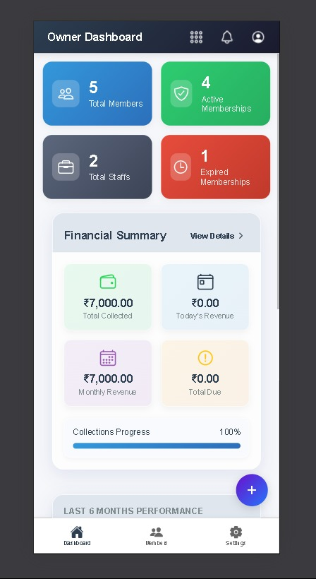
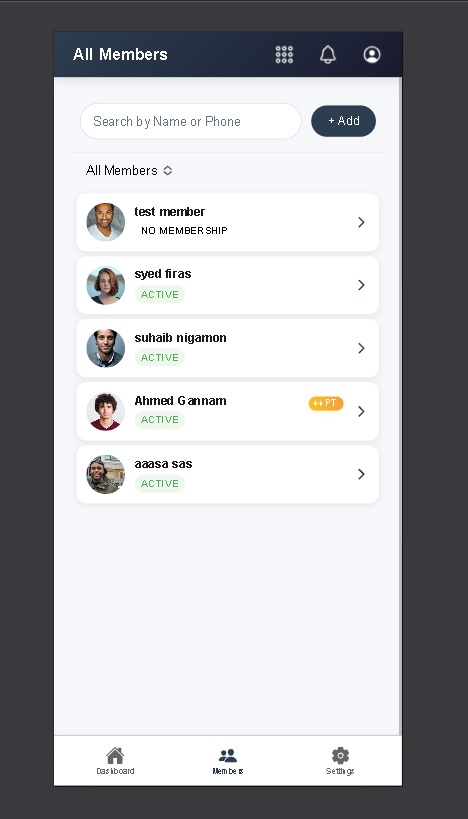

# Gym Net Solutions

An Easy to Use Gym Management System

---

**Gym Net Solutions** is a modern, cloud-powered gym management platform designed to help local gym owners digitize and automate their daily operations. Built with a mobile-first mindset, it provides an intuitive experience for both gym owners and members while reducing manual work through smart automation.

---

## 📸 Screenshots

---

## 🚀 Hosted Demo

A live demo is available for testing:

**[Test the Hosted Website](https://gymnetsolutions.netlify.app)**

---

## ✨ Features

- **Member Management**: Easily add, update, and manage gym members with detailed profiles and real-time status tracking.
- **Membership Management**: Create multiple membership plans, assign them to members, and automatically track active and expired memberships.
- **Automated Email Notifications**: Members automatically receive professional email notifications when their membership expires (powered by Make automation).
- **Owner Notifications**: Gym owners are notified when memberships expire, enabling quick follow-ups and renewals.
- **Owner Dashboard**: View active members, expired memberships, and overall gym activity in a clean and simple dashboard.
- **Transaction Tracking**: Record and manage payments and membership transactions for better financial clarity.
- **Staff & Personal Training Management**: Manage staff members and assign personal training packages to members.
- **Mobile-Friendly UI**: Clean, responsive interface built for both desktop and mobile usage.
- **Cloud-Hosted & Scalable**: Designed to scale easily with modern cloud infrastructure and automation tools.

---

## 🛠️ Tech Stack

- **Frontend**: [Ionic Angular](https://ionicframework.com/) (PWA & Mobile-ready)
- **Backend**: [Node.js](https://nodejs.org/) + [Express.js](https://expressjs.com/)
- **Database**: [Supabase](https://supabase.com/) (PostgreSQL)
- **Backend Hosting**: [Render](https://render.com/)
- **Automation & Emails**: [Make (Integromat)](https://www.make.com/) for event-based automation and email notifications
- **Push Notifications**: Firebase Cloud Messaging (FCM)

---

## 🎯 Project Vision

Gym Net Solutions aims to empower local gym owners with a simple yet powerful digital system to manage members, automate routine tasks, and improve engagement without relying on complex or expensive infrastructure. The project focuses on reliability, ease of use, and scalability, making it suitable for both small gyms and growing fitness businesses.

---

## 📬 Contact & More

For more information, collaboration, or feedback, feel free to connect via  
[LinkedIn](https://www.linkedin.com/in/ahmed-ghannam-563480260)

---

> _Gym Net Solutions — simplifying gym management through smart automation._

